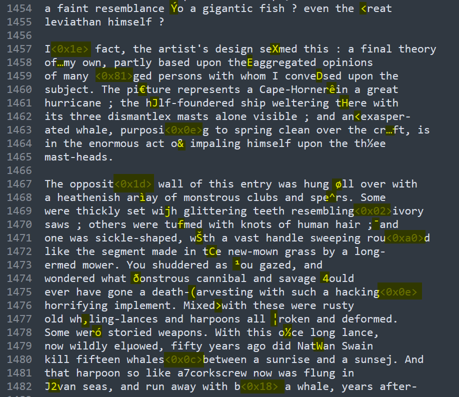
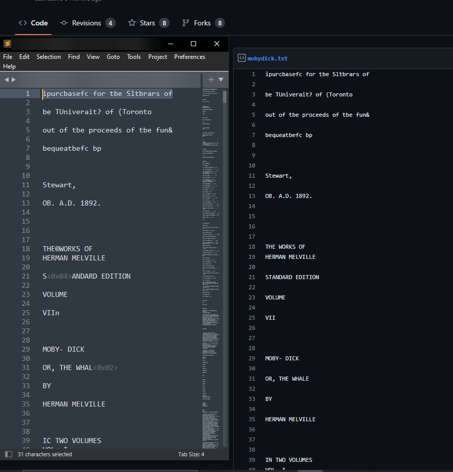

# 404CTF - Grand Ecart
---

## Category

> Stéganographie

## Description

> En sortant de votre cours de gymnastique, vous tombez sur un étrange bouquin dans les vestiaires... À vous d'en trouver tous les secrets.

## Files

[challenge.txt](challenge.txt)

## Difficulty

**MEDIUM** - 987 points

- Author: **@acmo0**
---


## Write up

### Salted Whale :whale:

We are given a large text file. By looking at it rapidly, it looks like it is the raw and complete content of the book "**Moby Dick**"


The second thing that came to my eyes very fast, is that **there are corrupted chars** left in the text :



The text had surely been altered to hide some data inside.

I first tried to search for `404CTF{` chars, but that wasn't promising.

The word "écart" in the title made me think two things :
- there must a sort of fixed space between interesting chars
- we must compare it with the original file

Let's begin with the second idea. By Googling few keywords in the text, we can find this [page](https://gist.github.com/StevenClontz/4445774):



We probably found the original text.

I checked that both texts have the same number of characters, and that matched perfectly:


That is our entry point. Now we have to find the data hidden in the differences.

### The big XOR

My first attempt was to read both files's bytes, and recover all the differences, like this :

```python
with open('challenge.txt', 'rb') as f:
	new = f.read()

with open('mobydick.txt', 'rb') as f:
	original = f.read()

diff = b''
for i in range(len(original)):
	if original[i] != new[i]:
		diff += (new[i]).to_bytes()

with open('moby', 'wb') as f:
	f.write(diff)
```

This scripts outputs a file with the known differences in bytes. However, the file does give __nothing intersting as is__.

The next idea I had was to **XOR** the original data with the embedded one, to recover the plain data hidden, like this:

```python
with open('challenge.txt', 'rb') as f:
	new = f.read()

with open('mobydick.txt', 'rb') as f:
	original = f.read()

xored = b''
for i in range(len(original)):
	if original[i] != new[i]:
		xored += (original[i] ^ new[i]).to_bytes()

with open('moby', 'wb') as f:
	f.write(xored)
```

The output was the following:


**We are on the way of having a PNG file !**


I used [hexed.it](https://hexed.it/) to view the file as in the screenshot, and [this page](https://en.wikipedia.org/wiki/List_of_file_signatures) can help you understand magic bytes


However, the **image is corrupted**. that does not work, even if we have the good file header and footer (`IEND`)

I tried fixing by hand the image, and couldn't do.

Then I understood why that could not work, because of one XOR property :
`a XOR a = 0`

By looking closer to the hex form of my file, **there was not any `00` byte**. This is because I took only the bytes that *differed* from the original one.

Or, if the byte to embed was `00`, the corresponding data would match the original one, because `a XOR 00 = a`

So, this way __my script could not work__, because some embedded data were missed, because **they were the same as the original one**.

That's where the true signification of "écart" comes in, which were part of my first idea: **each embedded byte are separated by the same space**

Let's just look at the space between few embedded ones, using that:

```python
with open('challenge.txt', 'rb') as f:
	new = f.read()

with open('mobydick.txt', 'rb') as f:
	original = f.read()

indexes = []
for i in range(len(original)):
	if original[i] != new[i]:
		indexes.append(i)

print(indexes[:20])
for i in range(20):
	print(indexes[i+1], "-", indexes[i], "=", indexes[i+1] - indexes[i])
```


This confirms our theories: **indexes difference are fixed**, and some are **skipped because they do not differ**.

We then have to used these informations:
- starts at index **150**
- ends at index **355860**
- the step is of **30**

We have all information needed to recover out data:
```python  
with open('challenge.txt', 'rb') as f:
	new = f.read()

with open('mobydick.txt', 'rb') as f:
	original = f.read()

xored = b''
first = 150
last = 355860
step = 30
for i in range(first, last, step):
	xored += (new[i] ^ original[i]).to_bytes()

with open('moby.png', 'wb') as f:
	f.write(xored)
```

And yes, we finally have an image:


No flag? Alright, [aperisolve](https://aperisolve.fr/6281adf3ebb8c5795c187350f909b00e) go brrrr :



:triangular_flag_on_post: `404CTF{you_spot_w3ll_the_differences}`

